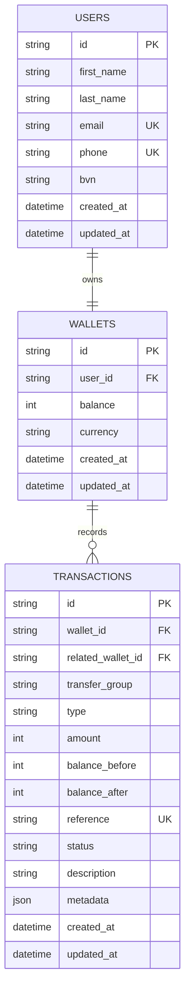

# Demo Credit Wallet Service

Production-quality MVP for the Lendsqr Backend Engineer Assessment V2. It contains a TypeScript Express backend using Knex and MySQL, plus a React/Vite reviewer UI for creating users, faux-login, wallet funding, transfers, withdrawals, and transaction history.

## Requirement Checklist

| Requirement | Implementation |
| --- | --- |
| Node.js LTS + TypeScript | `backend` and `frontend` are strict TypeScript workspaces |
| KnexJS + MySQL | `backend/src/config/knex.ts`, `backend/src/database/migrations` |
| Account creation with wallet | `POST /api/v1/users`, `UserService.create` |
| Adjutor Karma check before onboarding | `backend/src/modules/adjutor/adjutor.client.ts` |
| No onboarding on blacklist/dependency failure | `UserService.create`, explicit `KARMA_BLACKLISTED` and `ADJUTOR_UNAVAILABLE` errors |
| Faux token auth | `Authorization: Bearer <user_id>` or `x-user-id` in `fauxAuth.middleware.ts` |
| Fund, transfer, withdraw | `WalletService` with Knex transactions and `forUpdate` row locks |
| Own transactions only | `TransactionService.get` checks authenticated wallet ownership |
| Unit and integration tests | `backend/tests/unit`, `backend/tests/integration` |
| Modern UI | `frontend/src/main.tsx`, responsive CSS |
| Deployment readiness | Dockerfile, compose, env examples, production scripts |

## Tech Stack

Backend: Node.js, TypeScript, Express, Knex, MySQL, Zod, Axios, Helmet, CORS, rate limiting, Vitest, Supertest.

Frontend: React, Vite, TypeScript, lucide-react, CSS modules-style plain CSS.

## Architecture

The backend is layered by module. Controllers only translate HTTP requests and responses. Services hold business rules and transaction scopes. Repositories isolate Knex queries. Shared middleware centralizes auth, validation, request logging, and error handling.

```text
backend/src
  app.ts, server.ts
  config/
  database/migrations
  modules/{users,wallets,transactions,auth,adjutor}
  shared/{errors,middleware,utils,types}
frontend/src
  api/
  components/
  pages/
  hooks/
  types/
  utils/
```

## Database Design

Balances and transaction amounts are stored as integer minor units. `wallets.user_id` is unique so each user owns one wallet. Transfers create linked `TRANSFER_OUT` and `TRANSFER_IN` rows using `transfer_group`.



## API

Base URL: `http://localhost:4000`

Auth: send `Authorization: Bearer <user_id>` or `x-user-id: <user_id>`.

| Method | Path | Description |
| --- | --- | --- |
| GET | `/health` | Health check |
| POST | `/api/v1/users` | Create account and wallet after Adjutor check |
| GET | `/api/v1/users/me` | Current faux-authenticated user |
| GET | `/api/v1/wallets/me` | Current wallet |
| POST | `/api/v1/wallets/fund` | Fund wallet |
| POST | `/api/v1/wallets/transfer` | Transfer to another user |
| POST | `/api/v1/wallets/withdraw` | Withdraw funds |
| GET | `/api/v1/transactions?page=1&limit=20` | Paginated own transactions |
| GET | `/api/v1/transactions/:id` | Own transaction by id |

Create user:

```json
{
  "firstName": "Ada",
  "lastName": "Demo",
  "email": "ada@example.com",
  "phone": "08010000001",
  "bvn": "12345678901"
}
```

Successful responses use `{ "success": true, "data": ... }`. Errors use `{ "success": false, "error": { "code": "...", "message": "..." } }`.

## Adjutor Karma

`POST /api/v1/users` calls Adjutor before inserting any user or wallet. A blacklist hit returns `403`. Adjutor outages return `503` and onboarding is blocked. For local demos/tests only, set `ADJUTOR_BYPASS_ON_FAILURE=true`; production should keep it `false`.

## Transaction Handling

Funding, withdrawal, and transfer run inside Knex transactions. Wallet rows are selected with `forUpdate` before balance mutation. Transfers debit sender, credit recipient, and write both transaction records atomically, so any failure rolls back the full operation.

## Money Precision

Amounts are accepted as strings or numbers, validated with a decimal regex, and converted to integer minor units. Zero, negative, NaN, Infinity, and more than two decimal places are rejected. Persisted balances never use floating point values.

## Environment Variables

Copy examples:

```bash
cp backend/.env.example backend/.env
cp frontend/.env.example frontend/.env
```

Backend variables: `NODE_ENV`, `PORT`, `DATABASE_URL`, `ADJUTOR_BASE_URL`, `ADJUTOR_API_KEY`, `ADJUTOR_BYPASS_ON_FAILURE`, `CORS_ORIGIN`, `RATE_LIMIT_WINDOW_MS`, `RATE_LIMIT_MAX`.

Frontend variable: `VITE_API_BASE_URL`.

## Local Setup

```bash
npm install
docker compose up -d mysql
npm run migrate --workspace backend
npm run seed --workspace backend
npm run dev:backend
npm run dev:frontend
```

Backend runs on `http://localhost:4000`. Frontend runs on `http://localhost:5173`.

## Scripts

Root scripts include `install:all`, `dev`, `dev:backend`, `dev:frontend`, `build`, `start`, `migrate`, `rollback`, `seed`, `test`, `lint`, and `format`.

## Tests

```bash
npm run test --workspace backend
npm run typecheck --workspace backend
```

Integration tests cover health, validation, and auth response shape. Money handling and environment validation are covered by unit tests. Database-backed integration tests require a MySQL test database via `TEST_DATABASE_URL`.

## Deployment

The backend can deploy to Render, Railway, Fly.io, Heroku, or similar platforms with MySQL. Set the environment variables, run migrations as a release step, and start with `npm run start --workspace backend`.

Expected deployed URL pattern:

```text
https://<candidate-name>-lendsqr-be-test.<cloud-platform-domain>
```

Public deployment URL: `TODO: add deployed URL`

GitHub repo URL: `TODO: add GitHub URL`

Loom video URL: `TODO: add Loom URL`

## Assumptions and Limitations

Faux auth intentionally treats the user UUID as the token. The UI is a reviewer console, not a customer-facing product. Adjutor response shapes can vary, so the client treats a 404 as not blacklisted and other failures as dependency failures unless the documented local bypass is enabled.
